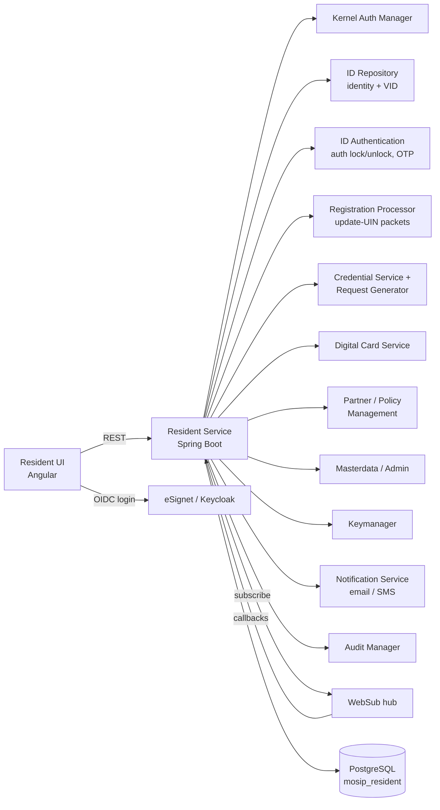

# KT Day 1 — MOSIP & Resident Services: Functional Overview + Resident UI Walkthrough

**Module:** resident-services (release v0.9.1 / repo tag v1.2.1.1)
**Duration:** 2 hours | **Audience:** All (developers, QA, support)
**KT Giver:** Kamesh | **KT Receiver:** Chetan
**Tracking:** [Confluence — RS KT from Kamesh to Chetan](https://mosip.atlassian.net/wiki/spaces/KnowledgeBase/pages/2652962893) | [KT Plan](./Resident-Services-KT-Plan.docx)

---

## Agenda

| # | Topic | Time |
|---|-------|------|
| 1 | What is MOSIP? Where does Resident Services fit? | 15 min |
| 2 | Resident UI walkthrough — every tile, live on test env | 45 min |
| 3 | High-level architecture & dependent MOSIP modules | 30 min |
| 4 | Repository tour | 15 min |
| 5 | Q&A + homework for Day 2 | 15 min |

---

## 1. What is MOSIP?

**MOSIP (Modular Open Source Identity Platform)** is an open-source platform countries use to build national digital ID systems. A resident enrolls once (registration), receives a **UIN (Unique Identification Number)**, and can then authenticate and use ID-based services.

Key ID concepts used throughout this module:

| Term | Meaning |
|------|---------|
| **UIN** | Unique Identification Number — the permanent ID issued to a resident |
| **VID** | Virtual ID — a temporary/revocable alias for the UIN. Types per VID policy: **perpetual**, **temporary**, **one-time** |
| **AID / RID** | Application ID / Registration ID — tracking number issued at registration, used before the UIN is issued |
| **Credential** | A verifiable, shareable representation of identity data (e.g., UIN card PDF, data shared to a partner) |
| **Event ID (EID)** | ID generated for each resident service request; used to track its status in Track My Requests |

**Where Resident Services fits:** it is the *self-service* layer of MOSIP. After a resident has a UIN, this module lets them manage it online — without visiting a registration center. The backend (this repo) exposes ≈88 REST endpoints across 25 controllers, consumed by the **Resident UI** ([mosip/resident-ui](https://github.com/mosip/resident-ui), Angular).

## 2. Resident UI Walkthrough

> Present this section live on the test environment. For each tile: show the UI action → name the API called → mention what happens behind the scenes.

### 2.1 Login (eSignet / OpenID Connect)

- Resident enters UIN/VID → receives OTP → logs in via **eSignet** (OIDC on Keycloak).
- Resident Service validates the **access token and ID token** (`/validate-token`, UIN-services login APIs), creates a session record (`resident_session`), and loads the resident's identity via `IdentityController` (`/identity/info`).
- Everything after login is scoped to the logged-in UIN/VID.

### 2.2 Portal chrome (visible on every page)

| Element | Function | Backing APIs |
|---|---|---|
| **Language selector** | Multi-language UI; data transliterated between languages | `TransliterationController` (`/transliteration/transliterate`) |
| **Font size** | Accessibility — resize text | UI-only |
| **Bell icon** | Notifications for async events, in chronological order; unread badge | `/unread/notification-count`, `/bell/notification-click`, `/bell/updatedttime`, `/notifications/{langCode}` |
| **Profile icon** | Name + photo of logged-in user, last login time, logout | `/profile`, `IdentityController` |
| **Workspace** | Dashboard of "Key Services" tiles | `ProxyConfigController` (UI spec: `/auth-proxy/config/ui-schema`) |

### 2.3 Key service tiles (UIN services)

**View My History**
Resident sees every transaction on their UIN/VID/AID — service requests, authentications, data shares — with filters by date/status; can download the history as PDF and report an unaccounted entry.
APIs: `/service-history/{langCode}`, `/download/service-history` (PDF). Data source: `resident_transaction` table.

**Secure My ID (auth lock/unlock)**
Resident views lock status of each authentication type and can lock/unlock: email OTP, phone OTP, demographic, fingerprint, iris, face. Locking prevents that modality from being used to authenticate — protection against misuse.
APIs: `/auth-lock-status` (fetch), `/auth-lock-unlock` (apply in IDA v2), legacy `/req/auth-lock`, `/req/auth-unlock`, history via `/req/auth-history`. Status change is confirmed asynchronously via a WebSub callback (`WebSubUpdateAuthTypeController`).

**Manage My VID**
View existing VIDs with expiry, generate a new VID, revoke a VID, download a VID card.
APIs: fetch VIDs (`/vids` proxy), generate `/vid`, revoke `/vid/{VID}`, VID policy JSON (proxy). VID card download goes through the credential flow — request stored with an Event ID, card ready notified via WebSub, then downloaded as PDF.

**Track My Requests**
Enter/select an Event ID → see current status and full details; download acknowledgements.
APIs: `/events/{event-id}`, `/aid/status`, `/rid/check-status`, `AcknowledgementController` (`/ack/download/pdf/{eventId}`).

**Get Personalized Card**
Resident selects attributes (minimum 3) to appear on the card, previews, and downloads a signed personalized card PDF.
APIs: `DownloadCardController` — personalized card creation and signing via Digital Card Service + Keymanager.

**Update My Data (update UIN)**
Resident edits demographic data (name, address, email, phone, DOB…), uploads supporting documents, and submits. Behind the scenes this creates a **registration packet** sent to **Registration Processor**; progress flows back asynchronously (WebSub `WebSubRegprocWorkFlowController`) and the resident is notified when identity is updated and the new card is ready.
APIs: `/req/update-uin`, `/update-uin`, document upload via `DocumentController` (`/documents` upload/fetch/delete), pending drafts APIs. Remaining-update-count per attribute via `ProxyIdRepoController`.

**Share My Data / Share My Credential**
Choose attributes to share with a registered partner (with optional masking/format per policy) to avail third-party services.
APIs: `ResidentCredentialController` — `/req/credential` (submit), `/req/credential/status/{requestId}`, cancel, card types; partner list via `ProxyPartnerManagementController`. Completion notified via WebSub (`WebSubCredentialStatusUpdateController`).

**Get My UIN**
Download the UIN card, or check AID status if the UIN isn't issued yet.
APIs: `/download-card/event/{eventId}`, `/aid/status`, digital card readiness callbacks.

**Order a Physical Card**
Order a printed card through a print partner, with payment; redirect back from the partner's order page.
APIs: `OrderCardController` — order card, payment redirect. (Related mock: payment provider APIs.)

**Get Information**
Registration centers (nearest / list, downloadable PDF) and supporting documents per document type.
APIs: `DownLoadMasterDataController` (`/download/registration-centers-list`, `/download/nearest…`, `/download/supporting-documents`), `ProxyMasterdataController` (locations, templates, document types, working days — 17 endpoints).

**Verify Email ID / Phone Number**
Send + validate OTP against a new email/phone to verify the channel.
APIs: `ProxyOtpController` (send/validate), `VerificationController` (`/channel/verification-status`).

**Grievance / Report an Issue**
Raise a grievance ticket tied to an Event ID.
APIs: `GrievanceController` (`/grievance/ticket`). Stored in `resident_grievance`.

**Book an Appointment**
Tile redirects to the **pre-registration portal** — no resident-services API involved.

### 2.4 Pin/Unpin events

Residents can pin important events in their history view: `PinStatusController` (`/pinned/{eventId}`, `/unpinned/{eventId}`).

## 3. High-Level Architecture



### Request path inside the service

```
Resident UI → Controller → Validator → Service (business logic)
            → external MOSIP service calls (RestTemplate/WebClient)
            → resident_transaction entry + audit + notification
            → response DTO back to UI
```

### Synchronous vs asynchronous

- **Synchronous:** most GET/lookup APIs respond immediately.
- **Asynchronous:** long-running flows (update UIN, card generation, credential share, VID card) return an **Event ID**; completion arrives later via **WebSub callbacks** (`WebSubCredentialStatusUpdateController`, `WebSubRegprocWorkFlowController`, `WebSubUpdateAuthTypeController`, `AuthTransactionCallbackController`), and `CredentialStatusUpdateBatchJob` polls/repairs credential statuses. Residents see results as bell notifications + email/SMS.

### Database (schema `mosip_resident`, 5 entities)

| Table/Entity | Purpose |
|---|---|
| `resident_transaction` | One row per service request — backbone of history, events, and notifications |
| `resident_grievance` | Grievance tickets |
| `otp_transaction` | OTPs for email/phone verification |
| `resident_user` | Last-login / bell-click bookkeeping per user |
| `resident_session` | Login session tracking |

*(Detailed column-level schema walkthrough is Day 2.)*

### Configuration

No hardcoded environment values — everything comes from **[mosip-config](https://github.com/mosip/mosip-config)** (tag 1.2.3.1 for this release):

- `application-default.properties` — platform-wide settings
- `resident-default.properties` — resident-module settings (service URLs, VID policy, template codes, allowed auth types, UIN update attributes, **API role mappings for authentication**…)

> v0.9.1 highlight: several previously hardcoded attributes moved into mosip-config.

## 4. Repository Tour

```
resident-services/
├── resident/
│   └── resident-service/          # THE Spring Boot service (main code)
│       └── src/main/java/io/mosip/resident/
│           ├── controller/        # 25 REST controllers (~88 endpoints)
│           ├── service/ + impl/   # business logic
│           ├── repository/        # Spring Data JPA repos
│           ├── entity/            # 5 JPA entities
│           ├── dto/               # request/response objects
│           ├── validator/         # request validation
│           ├── filter/ / interceptor/ / aspect/  # auth filter, logging
│           ├── batch/             # CredentialStatusUpdateBatchJob
│           ├── config/            # beans, swagger, security
│           ├── exception/ + handler/  # error codes & global handling
│           └── util/ / helper/ / function/
├── api-docs/                      # OpenAPI YAML per API (great reference!)
├── api-test/                      # automated API test rig (TestNG)
├── db_scripts/ + db_release_scripts/ + db_upgrade_scripts/  # PostgreSQL DDL
├── deploy/ + helm/ + deploy.sh    # Docker/K8s deployment
├── performance-test/              # JMeter scripts
└── docs/                          # images/misc
```

**Build stack:** Java + Spring Boot, Maven (`resident/pom.xml`), PostgreSQL, Keycloak/eSignet for auth, WebSub for pub-sub.

## 5. Release Context (v0.9.1)

- First patch after v0.9.0 — bug fixes, security & performance improvements (released 28 Jan 2025).
- Code tag: [resident-services v1.2.1.1](https://github.com/mosip/resident-services/tree/v1.2.1.1); UI v0.9.1; config v1.2.3.1.
- Known issues to be aware of (details Day 10): intermittent Update-My-Data failures (MOSIP-38771), VC verification failures for name/photo/address (MOSIP-31136), virtual-keyboard issues in UI, card name truncation.

## Homework (before Day 2)

1. Clone the repo and build: `cd resident && mvn clean install -DskipTests`
2. Skim `resident-default.properties` in mosip-config — note the service URLs and role-mapping properties.
3. Open 2–3 YAML files in `api-docs/` for services you saw today.
4. Log in to the test-environment Resident Portal and click through: View My History, Manage My VID, Secure My ID, Update My Data (don't submit).

## Reference Links

- KT tracking: <https://mosip.atlassian.net/wiki/spaces/KnowledgeBase/pages/2652962893>
- Release notes: <https://docs.mosip.io/1.2.0/roadmap-and-releases/releases/resident-services-v0.9.1>
- Functional overview: <https://docs.mosip.io/1.2.0/id-lifecycle-management/identity-management/resident-services/test/functional-overview>
- API documentation (Stoplight): <https://mosip.stoplight.io/docs/resident>
- Resident UI: <https://github.com/mosip/resident-ui>
- Config repo: <https://github.com/mosip/mosip-config>
