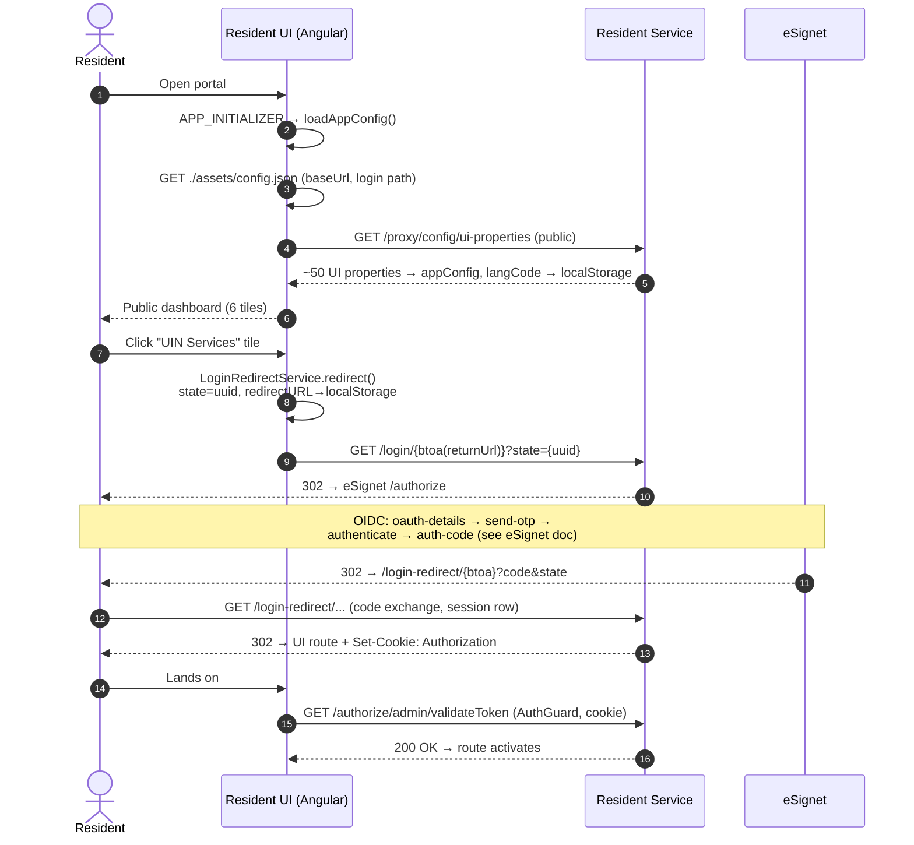
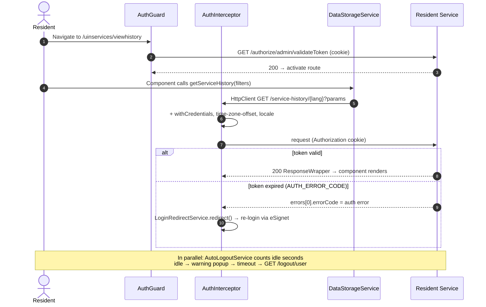
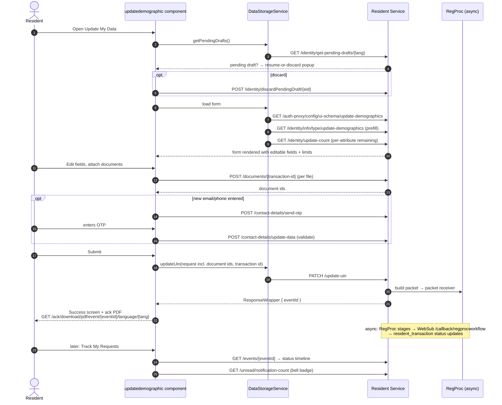

# Resident UI — Complete Flow (Bootstrap to API Call)

Source: extracted directly from resident-ui source code (tag v0.9.1, `resident-ui/src/app/`)
Repos: resident-ui (Angular), resident-services (backend), mosip-openid-bridge (login library), eSignet
Companion: [KT-eSignet-Login-Sequence.md](./KT-eSignet-Login-Sequence.md) (backend half of login)

---

## OVERVIEW — What happens from opening the portal to calling an API

```
Browser opens resident.dev2.mosip.net
  → APP_INITIALIZER → AppConfigService.loadAppConfig()
      → GET ./assets/config.json            (baseUrl, /login/, /logout/user)
      → GET {baseUrl}/proxy/config/ui-properties   (~50 properties copied into appConfig)
  → Public dashboard renders (no auth yet)
  → User clicks a UIN-services tile
      → LoginRedirectService.redirect()
      → window.location = {baseUrl}/login/{btoa(returnUrl)}?state={uuid}
      → [backend: eSignet OIDC dance → Authorization cookie → 302 back to UI route]
  → AuthguardService (route guard)
      → GET /authorize/admin/validateToken   (cookie-based check)
  → Every HTTP call goes through AuthInterceptor
      → withCredentials: true + time-zone-offset + locale headers
      → 401/token-expired detection → auto re-login redirect
  → Feature components call DataStorageService (single API gateway class)
  → AutoLogoutService (angular-user-idle) watches inactivity
      → idle+timeout exceeded → /logout/user
```

---

## PART 1 — APP BOOTSTRAP

### Phase 1 — APP_INITIALIZER

File: `app.module.ts`

Angular blocks rendering until `AppConfigService.loadAppConfig()` resolves:

```typescript
{ provide: APP_INITIALIZER, useFactory: appInitFn(appConfig), multi: true }
```

### Phase 2 — Two-stage config load

File: `app-config.service.ts`

```typescript
// Stage 1: static file baked into the build/deployment
this.appConfig = await this.http.get('./assets/config.json').toPromise();
// { "baseUrl": "https://api-internal.../resident/v1",
//   "login": "/login/", "logout": "/logout/user", "validateToken": ... }

// Stage 2: dynamic properties from the backend (NO auth needed — public endpoint)
const response = await this.http.get(this.appConfig.baseUrl + '/proxy/config/ui-properties').toPromise();
```

~50 properties are copied from the response into `appConfig`, including:

| Group | Properties |
|---|---|
| Languages | `mosip.mandatory-languages`, `mosip.optional-languages` → `supportedLanguages`; first mandatory language seeded into `localStorage.langCode` |
| API envelope ids/versions | `mosip.resident.api.id.otp.request`, `resident.vid.id`, `resident.updateuin.id`, `mosip.resident.request.response.version`… (used to build RequestWrapper bodies) |
| File-name conventions | `mosip.resident.uin.card.name.convention`, `...download.personalized.card.naming.convention`, per-feature ack name conventions |
| Feature config | `auth.types.allowed`, `resident.view.history.serviceType.filters`, `resident.view.history.status.filters`, `resident.nearby.centers.distance.meters` |
| Captcha | `mosip.resident.captcha.sitekey` |
| Auto logout | `mosip.webui.auto.logout.idle`, `.ping`, `.timeout` |
| External | `mosip-prereg-ui-url` (Book an Appointment tile), `mosip.resident.grievance.url` |

> KT point: this is why the **same UI build works on every environment** — everything env-specific comes from `assets/config.json` (deployment artifact) + `ui-properties` (mosip-config via ProxyConfigController).

### Phase 3 — Routing

File: `app-routing.module.ts` — lazy-loaded feature modules:

```
''            → redirect to dashboard (public tiles page)
'dashboard'   → DashboardModule           (public: 6 tiles)
'getuin'      → GetuinModule              (public: UIN download/AID status)
'document'    → DocumentModule            (public: supporting documents info)
'regcenter'   → BookingModule             (public: registration centers)
'verify'      → VerifyModule              (public: verify email/phone)
'uinservices' → UinservicesModule         (GUARDED: all logged-in features)
'downloaduin' → DownloadUinModule
```

`feature/uinservices/` submodules: `dashboard, viewhistory, trackservicerequest, lockunlockauth, revokevid (Manage My VID), personalisedcard, sharewithpartner, updatedemographic, physicalcard, grievance`.

---

## PART 2 — LOGIN (UI SIDE)

File: `core/services/loginredirect.service.ts`

```typescript
redirect(url: string) {
    const stateParam = uuid();                       // CSRF state
    let constructurl = url;
    if (url.split("#")[1] === "/dashboard") {        // public dashboard → logged-in dashboard
        constructurl = url.replace("/dashboard", "/uinservices/dashboard");
    }
    window.location.href = `${baseUrl}${login}` + btoa(constructurl) + "?state=" + stateParam;
    localStorage.setItem("redirectURL", constructurl);
}
```

Key details:

1. The **return URL is base64-encoded into the path**: `GET {baseUrl}/login/aHR0cHM6...?state=<uuid>` — that's the `/login/{redirectURI}` endpoint of `LoginController` (mosip-openid-bridge, embedded in resident-services).
2. Everything after this line is **backend + eSignet** (full detail in [KT-eSignet-Login-Sequence.md](./KT-eSignet-Login-Sequence.md)). The UI's next involvement: the browser lands back on the stored route with an `Authorization` cookie set by the backend.
3. The UI **never touches tokens** — no token in localStorage; only `redirectURL` and `langCode` live there.



---

## PART 3 — GUARD + INTERCEPTOR (every authenticated request)

### AuthguardService

File: `core/services/authguard.service.ts` — guards `uinservices/*` routes:

```typescript
canActivate(): Observable<boolean> {
    return this.authService.isAuthenticated();   // GET /authorize/admin/validateToken
}
```

`AuthService.isAuthenticated()` (`authservice.service.ts`) returns `res.status === 200` — the **cookie is the credential**; the browser sends it automatically.

### AuthInterceptor — the request pipeline

File: `core/services/httpinterceptor.ts`. Every `HttpClient` call is:

```typescript
request = request.clone({ withCredentials: true });          // send Authorization cookie
request = request.clone({ setHeaders: {
    'time-zone-offset': new Date().getTimezoneOffset(),      // for local-time rendering of history
    'locale': defaultJson['languages'][langCode]['locale']   // for localized error messages
}});
```

On the response side it watches for auth failures:

- If a `validateToken` response carries `errors[0].errorCode` in `AUTH_ERROR_CODE` (`app.constants.ts`) → token invalid/expired → clears state and calls `LoginRedirectService.redirect()` → user is bounced through the (usually silent) login again.
- Other API errors → localized error dialog (`shared/dialog/DialogComponent`) using messages from `assets/i18n/{lang}.json`.

### AutoLogoutService — idle watchdog

File: `core/services/auto-logout.service.ts` (wraps `angular-user-idle`):

- `idle` / `timeout` / `ping` values come from `mosip.webui.auto.logout.{idle,ping,timeout}` (ui-properties, i.e., mosip-config).
- After `idle` seconds of no activity → warning popup with countdown (`onTimerStart`); user can `continueWatching()`.
- After `timeout` more seconds → forced `GET /logout/user` → cookie cleared → back to public dashboard.



---

## PART 4 — DataStorageService: the single API gateway

File: `core/services/data-storage.service.ts` (~368 lines). Every feature component calls this one class; `BASE_URL = appConfig.baseUrl`. Complete endpoint map (UI method → backend):

| UI feature (module) | Endpoints called |
|---|---|
| Dashboard/bootstrap | `/proxy/config/ui-properties`, `/proxy/config/ui-schema`, `/auth-proxy/config/ui-schema/{type}`, `/auth-proxy/config/identity-mapping` |
| Profile + header bell | `/profile?languageCode=`, `/unread/notification-count`, `PUT /bell/updatedttime`, `/notifications/{langCode}` |
| View My History | `/service-history/{lang}?filters`, `/download/service-history` (blob PDF), `POST /pinned/{eventId}`, `POST /unpinned/{eventId}` |
| Track My Requests | `/events/{eid}?langCode=`, `/aid-stage/{aid}`, ack PDF `/ack/download/pdf/event/{eventId}/language/{lang}` (blob) |
| Secure My ID | `/auth-lock-status`, `POST /auth-lock-unlock` |
| Manage My VID | `/vid/policy`, `/vids`, `POST /generate-vid`, `PATCH /revoke-vid/{vid}`, VID card `/request-card/vid/{VID}` |
| Personalized card | `/identity/info/type/{schemaType}`, `POST /download/personalized-card` (blob) |
| Share My Data | `/auth-proxy/partners?partnerType=`, `POST /share-credential` |
| Update My Data | `/identity/info/type/update-demographics`, `/identity/update-count`, `/identity/get-pending-drafts/{lang}`, `POST /identity/discardPendingDraft/{eid}`, `POST /documents/{transaction-id}`, `POST /contact-details/send-otp`, `POST /contact-details/update-data`, `PATCH /update-uin` |
| Get My UIN (public) | `POST /req/otp`, `POST /validate-otp`, `POST /download-card` (blob), `POST /individualId/otp` |
| Verify email/phone (public) | `POST /individualId/otp`, `/channel/verification-status/?channel=&individualId=` |
| Order physical card | `/physical-card/order` (+ redirect back) |
| Grievance | `POST /grievance/ticket` |
| Get Information (public) | `/proxy/masterdata/*` (locations, validdocuments, registration centers), `/download/supporting-documents?langcode=` (blob), `/auth-proxy/masterdata/dynamicfields/preferredLang/...` |

Implementation details worth showing in KT:

- **Request envelopes are built client-side** using the ids/versions loaded at bootstrap (`resident.vid.id`, `resident.updateuin.id`…) — if these properties drift from what `RequestValidator` expects, you get `RES-SER` validation errors: a classic cross-repo bug.
- **PDF downloads** use `responseType: 'blob'`; file names come from the `*.name.convention` properties.
- **Public vs guarded calls:** `getuin`/`verify` modules use OTP-authenticated endpoints (`/req/otp`, `/validate-otp`, `/download-card`) with **captcha** (`shared/captcha`, sitekey from config, validated at `/validatecaptcha`) — no login cookie needed.

---

## PART 5 — WORKED EXAMPLE: Update My Data (UI ↔ backend, full detail)



---

## Key take-aways for the KT session

1. **One config pipeline** (`assets/config.json` → `ui-properties`) makes the build env-agnostic; most UI behavior is remote-controlled from mosip-config.
2. **Cookie-based auth, zero token handling in JS** — guard hits `validateToken`, interceptor adds `withCredentials`; token expiry is detected by error code and resolved by re-running the login redirect.
3. **DataStorageService is the single choke point** — when debugging any UI issue, find the method here first, then trace the backend controller (Day 4–8 READMEs).
4. **Request envelope ids/versions are config, not constants** — envelope mismatches between resident-ui, resident-services and mosip-config are a recurring bug class.
5. **Public flows (Get My UIN, Verify channel) use OTP + captcha instead of the login cookie** — different security model within the same app.

## Where the code lives

| Piece | File (resident-ui/src/app/) |
|---|---|
| Bootstrap config | `app-config.service.ts`, `app.module.ts` (APP_INITIALIZER) |
| Routing / lazy modules | `app-routing.module.ts`, `feature/uinservices/uinservices-routing.module.ts` |
| Login redirect | `core/services/loginredirect.service.ts` |
| Route guard | `core/services/authguard.service.ts` + `authservice.service.ts` |
| HTTP pipeline | `core/services/httpinterceptor.ts` |
| Idle logout | `core/services/auto-logout.service.ts` |
| API gateway | `core/services/data-storage.service.ts` |
| Feature screens | `feature/uinservices/*`, `feature/getuin`, `feature/verify`, `feature/booking`, `feature/document` |
| Captcha, dialogs, bell header | `shared/captcha`, `shared/dialog`, `shared/header` |
