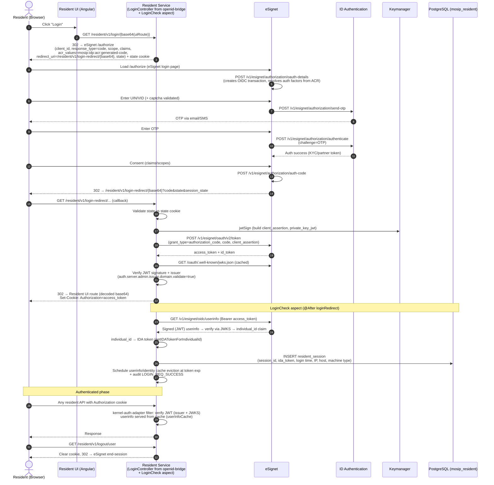

# eSignet Login Flow — Resident Portal (Sequence Diagram)

**Companion to:** [KT Day 3 — Authentication, Sessions & OTP](./KT-Day3-Authentication-Sessions-OTP.md)
**Sources:** resident-services code (tag v1.2.1.1), dev2 API automation report (2026-07-08, 1142/1142 passed), mosip-config properties captured in the report.

The login endpoints (`/login`, `/login-redirect`, `/authorize/admin/validateToken`, `/logout/user`) are **not** in resident-services' own controllers — they come from `io.mosip.kernel.authcodeflowproxy.api.controller.LoginController`, a library from **mosip-openid-bridge** (`kernel-authcodeflowproxy-api` 1.3.1 in `resident/pom.xml`). Resident-services hooks into it with the `LoginCheck` aspect to create sessions. The authorization APIs are served by **eSignet**.

---

## Endpoints in the flow (as seen in the dev2 automation report)

| Step | Endpoint | Host |
|---|---|---|
| Login start | `GET /resident/v1/login/{base64(uiRedirectUri)}` | api-internal.dev2 (resident) |
| OIDC authorize | `GET /authorize` (`mosip.iam.authorization_endpoint`) | esignet.dev2 |
| Create OIDC transaction | `POST /v1/esignet/authorization/oauth-details` | esignet.dev2 |
| Captcha | `POST /resident/v1/captcha/validatecaptcha` | resident-captcha (internal) |
| Send OTP | `POST /v1/esignet/authorization/send-otp` | esignet.dev2 |
| Authenticate | `POST /v1/esignet/authorization/authenticate` | esignet.dev2 |
| Get auth code | `POST /v1/esignet/authorization/auth-code` | esignet.dev2 |
| Login redirect (callback) | `GET /resident/v1/login-redirect/{base64Uri}?code&state&session_state` | api-internal.dev2 (resident) |
| Token exchange | `POST /v1/esignet/oauth/v2/token` (`mosip.iam.token_endpoint`) | esignet.dev2 |
| JWKS (signature keys) | `GET /v1/esignet/oauth/.well-known/jwks.json` (`mosip.iam.certs_endpoint`) | esignet.dev2 |
| User info | `GET /v1/esignet/oidc/userinfo` (`mosip.iam.userinfo_endpoint`) | esignet.dev2 |
| Per-request validation | JWT verified by kernel-auth-adapter (issuer + JWKS); admin variant `GET /authorize/admin/validateToken` | resident |
| Logout | `GET /resident/v1/logout/user` | resident |

Report evidence: test cases `Resident_ESignet_OAuthDetailsRequest_*`, `Resident_ESignet_AuthenticateUserIDP_uin_Otp_*`, `Resident_ESignet_AuthorizationCode_*`, `Resident_ESignet_GenerateToken_UIN_Cookie_*`. The captured oauth-details request shows: `responseType=code`, scopes incl. `Manage-Service-Requests Manage-Credentials`, `acrValues=mosip:idp:acr:generated-code`, `claims.userinfo.name`, and `redirectUri=https://api-internal.dev2.mosip.net/resident/v1/login-redirect/<base64 of resident UI route>`.

## Sequence Diagram



## Key implementation details (for the KT session)

1. **Two tokens, two purposes.** The `access_token` (as `Authorization` cookie) authenticates every API call; the `id_token` carries `acr/amr` — `IdentityServiceImpl.getResidentAuthenticationMode()` reads the authentication-mode claim from it (AMR→auth-type-code mapping file).
2. **The UI never sees the tokens.** The cookie is set by the backend on the api-internal domain; token exchange uses **private_key_jwt** (`mosip.iam.module.token.endpoint.private-key-jwt.auth.enabled=true`) — the client assertion is signed via **Keymanager jwtSign**, so there's no client secret in the browser.
3. **Session creation is an aspect, not a controller.** `aspect/LoginCheck` fires after `LoginController.loginRedirect(...)`: reads the `Authorization` Set-Cookie header, decodes `exp`, schedules cache eviction, resolves **ida_token** (userinfo → `individual_id` claim → `getIDATokenForIndividualId`) and inserts the **`resident_session`** row (session id = event id format, IP, host, machine type from User-Agent). Login failures audit `LOGIN_REQ_FAILURE`.
4. **Userinfo is a signed JWT and is cached** (`userInfoCache`, keyed by token; `UserInfoUtility`): signature verified via eSignet JWKS when `mosip.oidc.jwt.verify.enabled` — cache evicted at token expiry.
5. **Per-request validation is offline.** kernel-auth-adapter validates the JWT locally (issuer domain + JWKS); no round trip to eSignet per call. `/authorize/admin/validateToken` exists for the admin/legacy path.
6. **State cookie prevents CSRF** on the callback; the redirect URI whitelist is config (`mosip.iam.module.*` / allowed URLs) — classic misconfiguration source ("invalid redirect_uri" bugs).

## Config properties that wire the flow (dev2 values from the report)

```
mosip.iam.authorization_endpoint = https://esignet.dev2.mosip.net/authorize
mosip.iam.token_endpoint         = https://esignet.dev2.mosip.net/v1/esignet/oauth/v2/token
mosip.iam.userinfo_endpoint      = https://esignet.dev2.mosip.net/v1/esignet/oidc/userinfo
mosip.iam.certs_endpoint         = https://esignet.dev2.mosip.net/v1/esignet/oauth/.well-known/jwks.json
auth.server.admin.issuer.domain.validate = true
mosip.iam.module.token.endpoint.private-key-jwt.auth.enabled = true
mosip.resident.oidc.auth_token.expiry.claim-name = exp
```

## Where the code lives

| Piece | Repo / class |
|---|---|
| `/login`, `/login-redirect`, `/logout/user`, `validateToken` | **mosip-openid-bridge** → `kernel-authcodeflowproxy-api` → `LoginController` (pulled in via `resident/pom.xml`) |
| Session creation on login | **resident-services** → `aspect/LoginCheck` |
| Token → identity resolution | **resident-services** → `IdentityServiceImpl`, `UserInfoUtility`, `AvailableClaimValueUtility`, `ValidateTokenUtil` |
| Authorization APIs (oauth-details, send-otp, authenticate, auth-code, token, userinfo) | **esignet** repo |
| OTP delivery + verification | **id-authentication** (via eSignet's authenticator plugin) |
| Endpoint URLs & toggles | **mosip-config** → `resident-default.properties` / `application-default.properties` |
